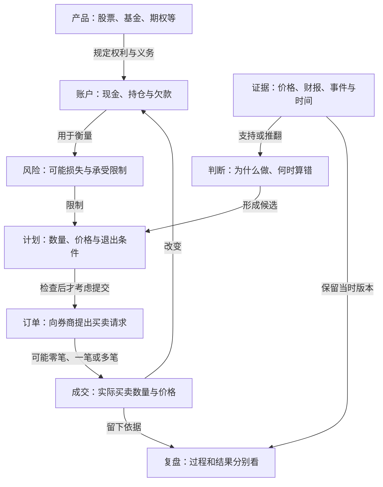

# 账户、证据、计划与订单的关系

教学示意；阅读说明及相关练习见 interactive/maps.html。

```mermaid
flowchart TD
    A[账户：现金、持仓与欠款] -->|用于衡量| R[风险：可能损失与承受限制]
    P[产品：股票、基金、期权等] -->|规定权利与义务| A
    D[证据：价格、财报、事件与时间] -->|支持或推翻| H[判断：为什么做、何时算错]
    H -->|形成候选| L[计划：数量、价格与退出条件]
    R -->|限制| L
    L -->|检查后才考虑提交| O[订单：向券商提出买卖请求]
    O -->|可能零笔、一笔或多笔| F[成交：实际买卖数量与价格]
    F -->|改变| A
    F -->|留下依据| V[复盘：过程和结果分别看]
    D -->|保留当时版本| V
```
