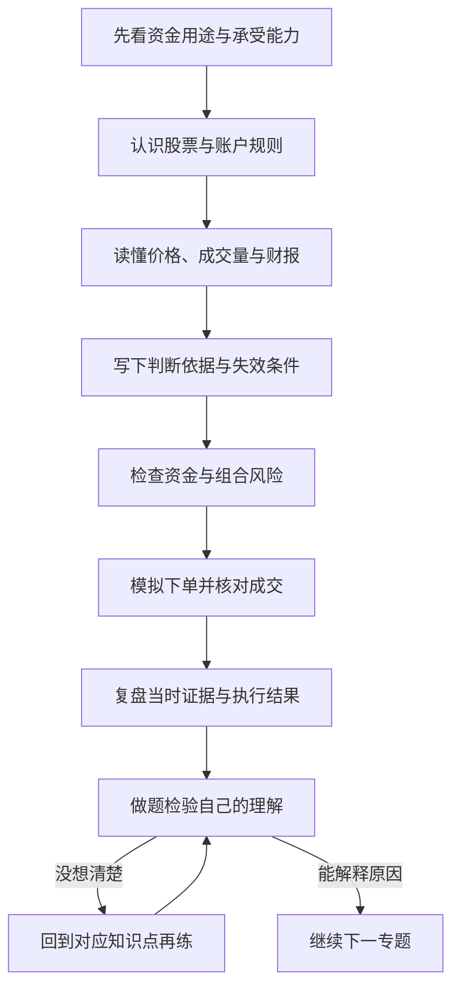

# 先学什么，后学什么

教学示意；阅读说明及相关练习见 interactive/maps.html。

```mermaid
flowchart TD
    A[先看资金用途与承受能力] --> B[认识股票与账户规则]
    B --> C[读懂价格、成交量与财报]
    C --> D[写下判断依据与失效条件]
    D --> E[检查资金与组合风险]
    E --> F[模拟下单并核对成交]
    F --> G[复盘当时证据与执行结果]
    G --> H[做题检验自己的理解]
    H -->|没想清楚| I[回到对应知识点再练]
    I --> H
    H -->|能解释原因| J[继续下一专题]
```
